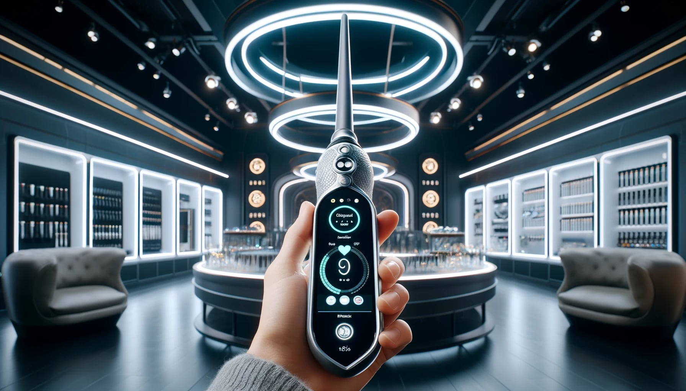
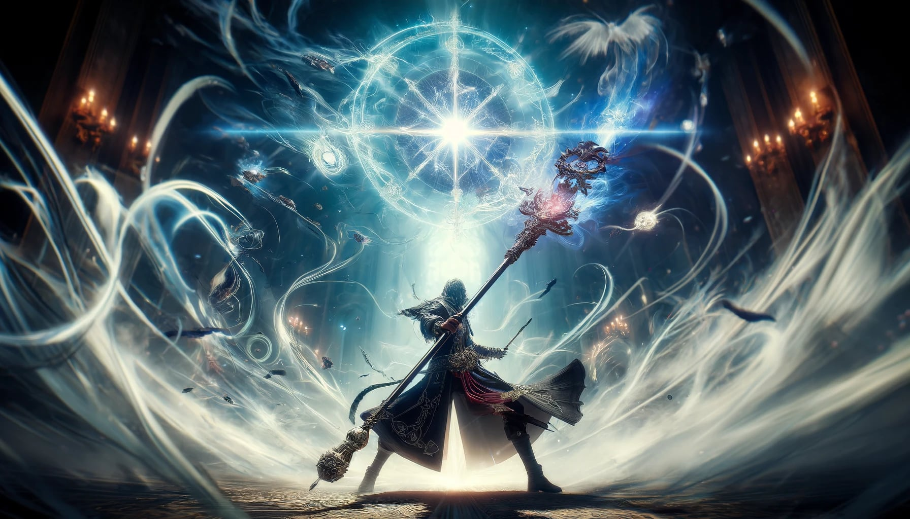

+++
title = 'Products'
date = 2024-03-17T00:13:20Z
draft = false
+++

At iWander, our magical emporium spans an impressive spectrum of products, from the simplest of spell-casting wands to formidable battle staffs, each designed to meet the needs of the modern witch, wizard, or warlock. Our collection marries tradition with technology, introducing groundbreaking features such as USB-C ports for easy charging of enchanted items, and diagnostic readouts that ensure your magical implements are operating at peak efficiency. Whether you're casting spells on the go or engaging 
in epic magical duels, our range of products ensures you're equipped with not just power, but also convenience and reliability. With iWander, embrace the future of magic, where ancient spells meet cutting-edge technology, empowering you to cast, conjure, and command like never before.

## iWand 6000

The iWand 6000 stands as the flagship masterpiece of iWander, encapsulating centuries of magical tradition and the latest in modern technological advancements. Small, light, and designed for discretion, it can be easily concealed within a sleeve or pocket, making it the perfect companion for the contemporary wizard on the move. Despite its compact form, the iWand 6000 is a powerhouse of magical capabilities.

Crafted from a blend of rare woods and enchantment-infused alloys, the iWand 6000 features a sleek, ergonomic design that belies its robust functionality. At its core lies a crystalline processor that enhances spell casting, making magic more accessible and potent. The wand is 
equipped with a USB-C port, allowing for rapid recharging of its magical reserves, and it boasts an innovative diagnostic readout system. This system provides real-time feedback on spell efficiency, wand health, and energy levels, ensuring that its wielder is always informed and prepared.

The iWand 6000's technology suite includes spell augmentation software, allowing for on-the-fly adjustments to spell parameters for precision casting. It also offers compatibility with a range of magical apps, from astral navigation to potion recipes, making it a versatile tool for any magical discipline. Whether used for everyday tasks, intricate enchantments, or defensive magic, the iWand 6000 is designed to seamlessly integrate into the modern wizard's lifestyle, representing the pinnacle of what it means to wield power with elegance and innovation.

## Demon Slayer II

The Demon Slayer II is the epitome of battle magic craftsmanship, a formidable battle staff designed for the mightiest of warrior mages. Its presence on the battlefield is a testament to the wielder's strength and mastery over the arcane arts. This hefty staff demands not only 
physical strength to be wielded effectively but also a profound depth of magical knowledge, making it the weapon of choice for those who have proven themselves in both domains.

Crafted from the ancient wood of the Whistling Thorn Tree, known for its resilience and affinity for offensive magic, and reinforced with dragon bone core, the Demon Slayer II is imbued with enchantments that amplify both offensive and defensive spells. Its surface is etched with runes of power, each painstakingly inscribed by the most revered magical artisans in the realm, granting its bearer the ability to cast devastating spells and invoke protective barriers that can withstand even the darkest of magics.

The staff's headpiece is adorned with a rare, enchanted gemstone that pulses with a fierce inner light, symbolizing the heart of a warrior mage. This gemstone is not only a source of additional magical power but also serves as a conduit for the wielder's own energy, enhancing spell accuracy and potency. The Demon Slayer II is equipped with a grip that molds to the hand of its rightful owner, ensuring that it can be wielded with unmatched precision and control.

Only those who have undergone rigorous training and have demonstrated unparalleled bravery and skill in combat can hope to harness the full potential of the Demon Slayer II. It is a weapon that not only amplifies the magical abilities of its wielder but also commands respect and awe on the 
battlefield, a true masterpiece of magical warfare designed to turn the tide in the fight against darkness.
